# ERD BangDeliv

Tanggal: 18 Juni 2026

Dokumen ini menjabarkan Entity Relationship Diagram (ERD) BangDeliv dalam bentuk teks dan Mermaid. Sumber utama analisis adalah migration Laravel dan ringkasan `docs/database_schema.md`.

Fokus ERD ini adalah domain bisnis aplikasi: user, driver, merchant, order, pembayaran, bukti, chat, dan chatbot AI. Tabel infrastruktur Laravel seperti `cache`, `jobs`, `sessions`, `password_reset_tokens`, dan `personal_access_tokens` tidak dijadikan pusat diagram karena sifatnya teknis pendukung.

## Legend

- `PK`: Primary key.
- `FK`: Foreign key.
- `UK`: Unique key.
- `nullable`: Relasi atau kolom boleh kosong.
- `1..1`: Satu data wajib berpasangan dengan satu data.
- `0..1`: Satu data boleh tidak punya pasangan, maksimal satu.
- `1..N`: Satu data dapat memiliki banyak data turunan.
- `logical`: Relasi digunakan oleh aplikasi, tetapi tidak selalu dipaksa oleh foreign key fisik.

## Ringkasan Domain

BangDeliv memakai `orders` sebagai tabel pusat transaksi. Semua service type, yaitu Ride, Courier, dan Shopping/Nitip, berbagi tabel order yang sama. Perbedaan detail tiap layanan disimpan dalam tabel turunan:

- `ride_order_details` untuk detail layanan antar penumpang.
- `courier_order_details` untuk detail layanan kurir barang.
- `shopping_order_items`, `shopping_order_receipts`, dan `order_locations` untuk layanan Nitip/belanja.

Desain ini membuat lifecycle order, driver assignment, payment, evidence, chat, dan audit event tetap konsisten untuk semua service type.

## ERD Utama

```mermaid
erDiagram
    USERS {
        bigint id PK
        string name
        string email UK
        string phone UK
        string role
        boolean is_active
        boolean is_blacklisted
        timestamp created_at
        timestamp deleted_at
    }

    DRIVERS {
        bigint id PK
        bigint user_id FK
        string vehicle_plate
        string vehicle_type
        string vehicle_brand
        string vehicle_model
        string license_number
        string registration_status
        string status
        decimal latitude
        decimal longitude
        timestamp location_updated_at
        timestamp deleted_at
    }

    DRIVER_DOCUMENTS {
        bigint id PK
        bigint driver_id FK
        bigint verified_by FK
        string document_type
        string file_url
        string verification_status
        timestamp verified_at
    }

    ADDRESSES {
        bigint id PK
        bigint user_id FK
        string label
        text address
        decimal latitude
        decimal longitude
        boolean is_default
    }

    DEVICE_TOKENS {
        bigint id PK
        bigint user_id FK
        string token UK
        string platform
        boolean is_active
        timestamp last_used_at
    }

    RESTAURANTS {
        bigint id PK
        string name
        string slug UK
        string merchant_type
        text address
        decimal latitude
        decimal longitude
        string phone
        string status
        timestamp deleted_at
    }

    MENU_CATEGORIES {
        bigint id PK
        bigint restaurant_id FK
        string name
        int sort_order
    }

    MENUS {
        bigint id PK
        bigint restaurant_id FK
        bigint menu_category_id FK
        string name
        decimal price
        boolean is_available
        int sort_order
        timestamp deleted_at
    }

    SERVICE_TYPES {
        bigint id PK
        string code UK
        string name
        boolean is_active
    }

    ORDER_STATUSES {
        bigint id PK
        string code UK
        string label
        int sort_order
    }

    SERVICE_FEE_RULES {
        bigint id PK
        bigint service_type_id FK
        string rule_code
        string label
        json rule_config
        boolean is_active
    }

    ORDERS {
        bigint id PK
        string order_number UK
        bigint user_id FK
        bigint service_type_id FK
        bigint driver_id FK
        bigint status_id FK
        decimal subtotal
        decimal delivery_fee
        decimal service_fee
        decimal total_price
        string delivery_fee_source
        json route_snapshot
        string cancelled_by
        text cancellation_reason
        timestamp assigned_at
        timestamp cancelled_at
        timestamp delivered_at
    }

    ORDER_LOCATIONS {
        bigint id PK
        bigint order_id FK
        bigint restaurant_id FK
        string location_role
        string label
        string contact_name
        string contact_phone
        text full_address
        decimal latitude
        decimal longitude
        int sequence_no
        string fulfillment_status
        text failure_reason
        timestamp failed_at
        timestamp resolved_at
    }

    SHOPPING_ORDER_ITEMS {
        bigint id PK
        bigint order_id FK
        bigint menu_id FK
        bigint pickup_location_id FK
        string item_source
        string menu_name
        int quantity
        decimal unit_price
        decimal subtotal
        text notes
        json metadata
        boolean is_available
        boolean is_heavy
    }

    ORDER_FEE_LINES {
        bigint id PK
        bigint order_id FK
        string code
        string label
        decimal amount
    }

    RIDE_ORDER_DETAILS {
        bigint id PK
        bigint order_id FK
        timestamp picked_up_at
        timestamp arrived_at
    }

    COURIER_ORDER_DETAILS {
        bigint id PK
        bigint order_id FK
        text package_description
        boolean careful_carry_required
    }

    SHOPPING_ORDER_RECEIPTS {
        bigint id PK
        bigint order_id FK
        bigint recorded_by_user_id FK
        decimal total_amount
        timestamp recorded_at
    }

    ORDER_PAYMENTS {
        bigint id PK
        bigint order_id FK
        bigint recorded_by_user_id FK
        bigint driver_id FK
        string payment_method
        string payment_status
        decimal amount
        timestamp paid_at
        json metadata
    }

    ORDER_EVIDENCE {
        bigint id PK
        bigint order_id FK
        bigint driver_id FK
        string evidence_type
        string file_url
        timestamp uploaded_at
        text notes
    }

    ORDER_EVENTS {
        bigint id PK
        bigint order_id FK
        bigint new_status_id FK
        bigint changed_by_user_id FK
        string event_type
        string trigger_type
        text note
        json metadata
        timestamp created_at
    }

    ORDER_CHAT_MESSAGES {
        bigint id PK
        bigint order_id FK
        bigint sender_user_id FK
        string sender_role
        string sender_name_snapshot
        text body
        string client_message_id
        string attachment_type
        string attachment_url
    }

    ORDER_CHAT_READS {
        bigint id PK
        bigint order_id FK
        bigint user_id FK
        bigint last_read_message_id FK
        timestamp read_at
    }

    AI_CHAT_SESSIONS {
        bigint id PK
        bigint user_id FK
        string session_id
        bigint completed_order_id FK
        timestamp last_message_at
        timestamp completed_at
    }

    AI_CHAT_MESSAGES {
        bigint id PK
        bigint user_id FK
        string session_id
        string role
        text message
        timestamp created_at
    }

    AI_MESSAGE_DETAILS {
        bigint id PK
        bigint chat_message_id FK
        bigint order_id FK
        json ai_response
        string model_used
        string intent
    }

    USERS ||--o| DRIVERS : has_driver_profile
    USERS ||--o{ ADDRESSES : owns
    USERS ||--o{ DEVICE_TOKENS : registers
    USERS ||--o{ ORDERS : places
    USERS ||--o{ DRIVER_DOCUMENTS : verifies
    DRIVERS ||--o{ DRIVER_DOCUMENTS : submits
    DRIVERS ||--o{ ORDERS : assigned_to
    DRIVERS ||--o{ ORDER_PAYMENTS : collects
    DRIVERS ||--o{ ORDER_EVIDENCE : uploads

    RESTAURANTS ||--o{ MENU_CATEGORIES : has
    RESTAURANTS ||--o{ MENUS : sells
    MENU_CATEGORIES ||--o{ MENUS : groups
    RESTAURANTS ||--o{ ORDER_LOCATIONS : becomes_pickup

    SERVICE_TYPES ||--o{ ORDERS : classifies
    SERVICE_TYPES ||--o{ SERVICE_FEE_RULES : defines
    ORDER_STATUSES ||--o{ ORDERS : current_status
    ORDER_STATUSES ||--o{ ORDER_EVENTS : status_snapshot

    ORDERS ||--o{ ORDER_LOCATIONS : has
    ORDERS ||--o{ SHOPPING_ORDER_ITEMS : contains
    ORDERS ||--o{ ORDER_FEE_LINES : has
    ORDERS ||--o| RIDE_ORDER_DETAILS : ride_detail
    ORDERS ||--o| COURIER_ORDER_DETAILS : courier_detail
    ORDERS ||--o| SHOPPING_ORDER_RECEIPTS : shopping_receipt
    ORDERS ||--o| ORDER_PAYMENTS : payment
    ORDERS ||--o{ ORDER_EVIDENCE : evidence
    ORDERS ||--o{ ORDER_EVENTS : audit_log
    ORDERS ||--o{ ORDER_CHAT_MESSAGES : chat
    ORDERS ||--o{ ORDER_CHAT_READS : read_marker
    ORDERS ||--o{ AI_CHAT_SESSIONS : completed_by_ai
    ORDERS ||--o{ AI_MESSAGE_DETAILS : ai_detail

    ORDER_LOCATIONS ||--o{ SHOPPING_ORDER_ITEMS : pickup_for
    MENUS ||--o{ SHOPPING_ORDER_ITEMS : menu_snapshot

    USERS ||--o{ ORDER_PAYMENTS : records
    USERS ||--o{ SHOPPING_ORDER_RECEIPTS : records
    USERS ||--o{ ORDER_EVENTS : changes
    USERS ||--o{ ORDER_CHAT_MESSAGES : sends
    USERS ||--o{ ORDER_CHAT_READS : reads
    ORDER_CHAT_MESSAGES ||--o{ ORDER_CHAT_READS : last_read_message

    USERS ||--o{ AI_CHAT_SESSIONS : starts
    USERS ||--o{ AI_CHAT_MESSAGES : sends
    AI_CHAT_MESSAGES ||--o| AI_MESSAGE_DETAILS : has_detail
```



## Modul Identitas dan Driver

### `users`

Menyimpan akun customer, driver, dan admin. Kolom `role` menjadi pembeda peran aplikasi, sedangkan `is_active` dan `is_blacklisted` mengontrol akses operasional.

Relasi utama:

- Satu user dapat memiliki banyak alamat di `addresses`.
- Satu user dapat memiliki satu profil driver di `drivers`.
- Satu user dapat membuat banyak order di `orders`.
- Satu user dapat mengirim pesan order dan pesan chatbot.
- Admin atau user tertentu dapat tercatat sebagai `changed_by_user_id` pada `order_events`.

### `drivers`

Menyimpan profil operasional driver. Relasi `drivers.user_id` bersifat unique, sehingga satu akun user hanya dapat memiliki satu profil driver.

Relasi utama:

- Satu driver memiliki banyak dokumen di `driver_documents`.
- Satu driver dapat menerima banyak order.
- Satu driver dapat mengunggah banyak evidence.
- Satu driver dapat tercatat pada `order_payments` untuk pembayaran yang dikumpulkan atau diverifikasi driver.

Catatan:

- Lokasi terakhir driver disimpan langsung di `drivers.latitude`, `drivers.longitude`, dan `drivers.location_updated_at`.
- Riwayat lokasi detail tidak dimodelkan sebagai tabel terpisah pada schema saat ini.

### `driver_documents`

Menyimpan dokumen verifikasi driver seperti KTP, SIM, atau STNK. Kolom `verified_by` mengarah ke `users`, biasanya admin.

Kardinalitas:

- `drivers` 1..N `driver_documents`.
- `users` 0..N `driver_documents` sebagai verifier.

### `addresses`

Menyimpan alamat customer. Alamat ini dapat dipakai sebagai titik antar atau referensi pembuatan order.

Kardinalitas:

- `users` 1..N `addresses`.

### `device_tokens`

Menyimpan token notifikasi perangkat user.

Kardinalitas:

- `users` 1..N `device_tokens`.

## Modul Merchant dan Menu

### `restaurants`

Menyimpan merchant yang dapat berupa restoran, warung, convenience store, atau tipe merchant lain. Walaupun nama tabelnya `restaurants`, secara domain tabel ini merepresentasikan merchant.

Relasi utama:

- Satu merchant memiliki banyak kategori menu.
- Satu merchant memiliki banyak menu.
- Satu merchant dapat menjadi pickup location pada `order_locations`.

### `menu_categories`

Mengelompokkan menu per merchant.

Kardinalitas:

- `restaurants` 1..N `menu_categories`.
- Kombinasi `restaurant_id` dan `name` unik.

### `menus`

Menyimpan katalog item dari merchant. Saat order dibuat, data menu disalin ke `shopping_order_items` sebagai snapshot supaya perubahan menu di masa depan tidak merusak histori order.

Relasi utama:

- `restaurants` 1..N `menus`.
- `menu_categories` 0..N `menus`.
- `menus` 0..N `shopping_order_items`.

Catatan:

- `shopping_order_items.menu_id` nullable karena item Nitip bisa berasal dari input manual customer.
- Untuk item manual, sumber item ditandai melalui `item_source = MANUAL`.

## Modul Master Layanan

### `service_types`

Menyimpan jenis layanan aplikasi, misalnya:

- `RIDE`
- `COURIER`
- `SHOPPING`

Relasi utama:

- Satu service type memiliki banyak order.
- Satu service type memiliki banyak service fee rule.

### `order_statuses`

Lookup lifecycle status order. Tabel ini menggantikan enum status langsung di `orders`, sehingga status lebih mudah diperluas.

Relasi utama:

- Satu status dapat menjadi status aktif banyak order.
- Satu status dapat dicatat sebagai `new_status_id` pada banyak `order_events`.

### `service_fee_rules`

Menyimpan aturan biaya layanan per service type. Detail formula disimpan di `rule_config` agar aturan dapat berubah tanpa menambah kolom baru.

Kardinalitas:

- `service_types` 1..N `service_fee_rules`.

## Modul Order Inti

### `orders`

Tabel pusat seluruh transaksi. Setiap order wajib memiliki customer, service type, dan status. Driver bersifat nullable karena order dapat dibuat sebelum driver menerima tugas.

Kolom penting:

- `order_number`: nomor order unik.
- `subtotal`: total item atau biaya dasar.
- `delivery_fee`: ongkir.
- `service_fee`: biaya layanan.
- `total_price`: total pembayaran.
- `delivery_fee_source`: sumber ongkir, misalnya system atau manual driver.
- `route_snapshot`: snapshot jarak/rute saat order dibuat atau direvisi.
- `cancelled_by`, `cancellation_reason`, `cancelled_at`: informasi pembatalan.
- `assigned_at`, `delivered_at`: timestamp lifecycle operasional.

Relasi utama:

- `users` 1..N `orders`.
- `service_types` 1..N `orders`.
- `order_statuses` 1..N `orders`.
- `drivers` 0..N `orders`.
- `orders` 1..N `order_locations`.
- `orders` 1..N `order_fee_lines`.
- `orders` 0..1 `order_payments`.
- `orders` 0..1 detail service type sesuai jenis layanan.

Catatan desain:

- `orders` sengaja menyimpan nilai total final agar histori transaksi tetap stabil.
- Kalkulasi ulang biaya harus memperhatikan apakah nilai sudah disetujui customer atau sudah direvisi manual driver.

### `order_locations`

Menyimpan titik lokasi order. Untuk Ride dan Courier, biasanya berisi pickup dan dropoff. Untuk Shopping/Nitip, tabel ini dapat menyimpan beberapa pickup merchant dan satu dropoff customer.

Kolom penting:

- `location_role`: `PICKUP` atau `DROPOFF`.
- `restaurant_id`: nullable, digunakan ketika lokasi adalah merchant.
- `sequence_no`: urutan rute.
- `fulfillment_status`: status pemenuhan titik pickup/dropoff.
- `failure_reason`, `failed_at`, `resolved_at`: informasi ketika merchant tutup atau pickup gagal.

Kardinalitas:

- `orders` 1..N `order_locations`.
- `restaurants` 0..N `order_locations`.
- Kombinasi `order_id`, `location_role`, dan `sequence_no` unik.

### `order_fee_lines`

Menyimpan rincian biaya per order, misalnya biaya layanan, biaya item berat, adjustment, atau fee lain.

Kardinalitas:

- `orders` 1..N `order_fee_lines`.
- Kombinasi `order_id` dan `code` unik.

Catatan:

- Tabel ini berguna untuk history driver/customer karena nilai fee dapat ditampilkan terpisah tanpa menghitung ulang dari aturan terbaru.

## Modul Service Type Detail

### `ride_order_details`

Detail khusus layanan Ride.

Kolom:

- `picked_up_at`
- `arrived_at`

Kardinalitas:

- `orders` 0..1 `ride_order_details`.

Constraint bisnis:

- Trigger database memastikan data hanya boleh dibuat untuk order dengan `service_types.code = RIDE`.

### `courier_order_details`

Detail khusus layanan Courier.

Kolom:

- `package_description`
- `careful_carry_required`

Kardinalitas:

- `orders` 0..1 `courier_order_details`.

Constraint bisnis:

- Trigger database memastikan data hanya boleh dibuat untuk order dengan `service_types.code = COURIER`.

### `shopping_order_items`

Detail item untuk layanan Shopping/Nitip. Item dapat berasal dari menu database atau input manual customer.

Kolom penting:

- `menu_id`: nullable, mengarah ke menu asli jika item berasal dari katalog.
- `pickup_location_id`: mengarah ke merchant/pickup location tempat item dibeli.
- `item_source`: `MENU_DB` atau `MANUAL`.
- `menu_name`: snapshot nama item saat order.
- `quantity`, `unit_price`, `subtotal`: snapshot harga saat order.
- `is_available`: status ketersediaan item yang dikonfirmasi driver.
- `is_heavy`: penanda item berat.
- `metadata`: data tambahan, misalnya catatan proses revisi item.

Kardinalitas:

- `orders` 1..N `shopping_order_items`.
- `order_locations` 0..N `shopping_order_items`.
- `menus` 0..N `shopping_order_items`.

Constraint bisnis:

- Trigger database memastikan item hanya boleh dibuat untuk order dengan `service_types.code = SHOPPING`.

Catatan penting:

- Untuk multi-merchant Nitip, item harus diarahkan ke `pickup_location_id` yang sesuai.
- Ketika customer menambah item manual saat revisi, merchant tidak perlu dipilih ulang jika `pickup_location_id` sudah diketahui dari konteks merchant yang sedang diedit.

### `shopping_order_receipts`

Menyimpan total belanja dari struk atau input driver untuk layanan Shopping/Nitip.

Kardinalitas:

- `orders` 0..1 `shopping_order_receipts`.
- `users` 0..N `shopping_order_receipts` sebagai pencatat.

Constraint bisnis:

- Trigger database memastikan receipt hanya boleh dibuat untuk order dengan `service_types.code = SHOPPING`.

## Modul Pembayaran, Bukti, dan Audit

### `order_payments`

Menyimpan pembayaran order. Satu order maksimal memiliki satu record payment.

Kolom penting:

- `payment_method`: `COD` atau `TRANSFER`.
- `payment_status`: `PENDING`, `PAID`, atau `VOID`.
- `amount`: nominal pembayaran.
- `recorded_by_user_id`: user yang mencatat pembayaran.
- `driver_id`: driver terkait pembayaran.
- `metadata`: data tambahan, misalnya referensi bukti transfer.

Kardinalitas:

- `orders` 0..1 `order_payments`.
- `users` 0..N `order_payments` sebagai recorder.
- `drivers` 0..N `order_payments`.

### `order_evidence`

Menyimpan bukti visual terkait order, misalnya foto pickup, delivery, struk shopping, merchant tutup, atau bukti transfer.

Kardinalitas:

- `orders` 1..N `order_evidence`.
- `drivers` 0..N `order_evidence`.

### `order_events`

Menyimpan audit log dan histori status order.

Kolom penting:

- `event_type`: jenis event, misalnya status berubah, revisi ongkir, merchant tutup, pembayaran diterima.
- `new_status_id`: status baru jika event terkait perubahan status.
- `trigger_type`: sumber event, misalnya customer action, driver action, system action.
- `changed_by_user_id`: user yang memicu event.
- `metadata`: payload tambahan untuk audit.

Kardinalitas:

- `orders` 1..N `order_events`.
- `order_statuses` 0..N `order_events`.
- `users` 0..N `order_events`.

Catatan:

- Model aplikasi seperti `OrderLog` atau `OrderStatusHistory` dapat memakai tabel ini sebagai sumber histori, meskipun tidak ada tabel terpisah bernama `order_status_histories`.

## Modul Chat Order

### `order_chat_messages`

Menyimpan pesan chat antara customer dan driver dalam konteks order.

Kolom penting:

- `order_id`
- `sender_user_id`
- `sender_role`
- `sender_name_snapshot`
- `body`
- `client_message_id`
- `attachment_type`, `attachment_url`, `attachment_mime_type`, `attachment_size`

Kardinalitas:

- `orders` 1..N `order_chat_messages`.
- `users` 1..N `order_chat_messages`.

Constraint:

- Kombinasi `order_id`, `sender_user_id`, dan `client_message_id` unik untuk deduplikasi pesan dari client.

### `order_chat_reads`

Menyimpan marker pesan terakhir yang sudah dibaca user pada order tertentu.

Kardinalitas:

- `orders` 1..N `order_chat_reads`.
- `users` 1..N `order_chat_reads`.
- `order_chat_messages` 0..N `order_chat_reads` sebagai `last_read_message_id`.

Constraint:

- Kombinasi `order_id` dan `user_id` unik.

## Modul Chatbot AI

### `ai_chat_sessions`

Menyimpan sesi percakapan chatbot per user. Jika sesi berhasil membuat order, `completed_order_id` mengarah ke order tersebut.

Kardinalitas:

- `users` 1..N `ai_chat_sessions`.
- `orders` 0..N `ai_chat_sessions`.

Constraint:

- Kombinasi `user_id` dan `session_id` unik.

### `ai_chat_messages`

Menyimpan pesan user dan assistant dalam sesi chatbot.

Kardinalitas:

- `users` 1..N `ai_chat_messages`.
- Relasi ke `ai_chat_sessions` bersifat logical melalui `user_id` dan `session_id`.

Catatan:

- `session_id` bukan foreign key fisik ke `ai_chat_sessions`, tetapi digunakan sebagai penghubung logis.

### `ai_message_details`

Menyimpan detail hasil pemrosesan AI untuk satu pesan chatbot.

Kolom penting:

- `chat_message_id`: unique FK ke `ai_chat_messages`.
- `ai_response`: payload JSON respons AI.
- `model_used`: model AI yang digunakan.
- `intent`: intent hasil klasifikasi.
- `order_id`: order terkait jika ada.

Kardinalitas:

- `ai_chat_messages` 0..1 `ai_message_details`.
- `orders` 0..N `ai_message_details`.

## Relasi Per Service Type

### Ride

```text
users
  1..N orders
orders
  N..1 service_types(code = RIDE)
  1..N order_locations
  0..1 ride_order_details
  0..1 order_payments
  1..N order_events
```

Makna:

- Customer membuat order Ride.
- Order memiliki pickup dan dropoff di `order_locations`.
- Detail waktu pickup dan arrived disimpan di `ride_order_details`.
- Status tetap dikontrol melalui `orders.status_id` dan histori `order_events`.

### Courier

```text
users
  1..N orders
orders
  N..1 service_types(code = COURIER)
  1..N order_locations
  0..1 courier_order_details
  0..1 order_payments
  1..N order_evidence
```

Makna:

- Customer membuat order Courier.
- Detail paket ada di `courier_order_details`.
- Foto pickup, delivery, atau penerima dapat disimpan di `order_evidence`.

### Shopping/Nitip

```text
users
  1..N orders
orders
  N..1 service_types(code = SHOPPING)
  1..N order_locations
  1..N shopping_order_items
  0..1 shopping_order_receipts
  0..1 order_payments
restaurants
  0..N order_locations(location_role = PICKUP)
order_locations
  0..N shopping_order_items
```

Makna:

- Customer membuat order Nitip melalui chatbot atau form.
- Tiap merchant dipresentasikan sebagai `order_locations` dengan `location_role = PICKUP`.
- Alamat customer dipresentasikan sebagai `order_locations` dengan `location_role = DROPOFF`.
- Tiap item Nitip diarahkan ke merchant melalui `shopping_order_items.pickup_location_id`.
- Struk final atau total belanja driver disimpan di `shopping_order_receipts`.

## Kardinalitas Penting

| Parent | Child | Kardinalitas | Keterangan |
| --- | --- | --- | --- |
| `users` | `drivers` | 1 ke 0..1 | Tidak semua user adalah driver. |
| `users` | `addresses` | 1 ke N | Customer dapat menyimpan banyak alamat. |
| `drivers` | `orders` | 1 ke N | Order dapat belum punya driver saat dibuat. |
| `service_types` | `orders` | 1 ke N | Tiap order wajib punya service type. |
| `order_statuses` | `orders` | 1 ke N | Tiap order wajib punya status aktif. |
| `orders` | `order_locations` | 1 ke N | Semua layanan memakai titik lokasi. |
| `orders` | `shopping_order_items` | 1 ke N | Hanya untuk service Shopping/Nitip. |
| `order_locations` | `shopping_order_items` | 1 ke N | Pickup merchant memiliki item belanja. |
| `orders` | `order_payments` | 1 ke 0..1 | Satu order maksimal satu payment. |
| `orders` | `order_events` | 1 ke N | Audit dan status history. |
| `orders` | `order_evidence` | 1 ke N | Bukti foto atau file terkait order. |
| `orders` | `ride_order_details` | 1 ke 0..1 | Hanya untuk Ride. |
| `orders` | `courier_order_details` | 1 ke 0..1 | Hanya untuk Courier. |
| `orders` | `shopping_order_receipts` | 1 ke 0..1 | Hanya untuk Shopping/Nitip. |
| `orders` | `order_chat_messages` | 1 ke N | Chat customer-driver per order. |
| `ai_chat_messages` | `ai_message_details` | 1 ke 0..1 | Detail AI hanya untuk pesan yang diproses AI. |

## Catatan Normalisasi dan Snapshot

Beberapa data sengaja disimpan sebagai snapshot, bukan selalu dihitung ulang dari tabel master:

- `orders.subtotal`, `orders.delivery_fee`, `orders.service_fee`, dan `orders.total_price` menyimpan nilai transaksi final.
- `orders.route_snapshot` menyimpan snapshot rute/jarak saat order dibuat atau saat ongkir direvisi.
- `shopping_order_items.menu_name`, `unit_price`, dan `subtotal` menyimpan snapshot item saat order.
- `order_locations.full_address`, latitude, dan longitude menyimpan snapshot alamat saat order.
- `order_chat_messages.sender_name_snapshot` menyimpan nama pengirim saat pesan dibuat.

Alasan:

- Histori order tetap stabil walaupun merchant, menu, alamat, atau profil user berubah.
- Detail transaksi lama tetap dapat ditampilkan tanpa menghitung ulang dari data master terbaru.
- Revisi ongkir dan persetujuan customer dapat dilacak dengan jelas.

## Catatan Constraint Bisnis

Schema memakai kombinasi foreign key, unique constraint, index, dan trigger database.

Constraint penting:

- `drivers.user_id` unique, sehingga satu user hanya punya satu profil driver.
- `orders.order_number` unique.
- `order_fee_lines` unique per `order_id` dan `code`.
- `order_locations` unique per `order_id`, `location_role`, dan `sequence_no`.
- `order_payments.order_id` unique.
- `ride_order_details.order_id`, `courier_order_details.order_id`, dan `shopping_order_receipts.order_id` unique.
- `ai_message_details.chat_message_id` unique.
- Trigger memastikan tabel detail service hanya dipakai oleh service type yang sesuai:
  - `ride_order_details` hanya untuk `RIDE`.
  - `courier_order_details` hanya untuk `COURIER`.
  - `shopping_order_items` dan `shopping_order_receipts` hanya untuk `SHOPPING`.

## Tabel Pendukung yang Tidak Ditampilkan di ERD Utama

Tabel berikut tetap ada di database, tetapi tidak dijadikan pusat ERD bisnis:

- `password_reset_tokens`: reset password Laravel.
- `sessions`: session Laravel.
- `cache`, `cache_locks`: cache Laravel.
- `jobs`, `job_batches`, `failed_jobs`: queue Laravel.
- `personal_access_tokens`: token Sanctum/API auth.

Tabel tersebut boleh dibuat sebagai diagram terpisah jika dokumentasi teknis backend membutuhkan gambaran lengkap infrastruktur aplikasi.

## Arahan Untuk Membuat Diagram Draw.io

Gunakan struktur berikut saat menerjemahkan dokumen ini ke Draw.io:

1. Letakkan `orders` di tengah diagram.
2. Letakkan cluster `users`, `drivers`, `addresses`, dan `device_tokens` di sisi kiri.
3. Letakkan cluster `restaurants`, `menu_categories`, dan `menus` di sisi kanan atas.
4. Letakkan `order_locations`, `shopping_order_items`, dan `shopping_order_receipts` di kanan tengah karena paling penting untuk Nitip multi-merchant.
5. Letakkan `ride_order_details` dan `courier_order_details` di bawah `orders`.
6. Letakkan `order_payments`, `order_fee_lines`, `order_evidence`, dan `order_events` di bawah kanan sebagai modul transaksi dan audit.
7. Letakkan `order_chat_messages`, `order_chat_reads`, `ai_chat_sessions`, `ai_chat_messages`, dan `ai_message_details` di bawah kiri sebagai modul komunikasi.
8. Gunakan warna berbeda per cluster:
   - Identitas: biru.
   - Merchant dan menu: hijau.
   - Order inti: oranye.
   - Detail layanan: ungu.
   - Pembayaran dan audit: merah muda.
   - Chat dan AI: abu-abu atau teal.
9. Beri label `nullable` pada relasi `orders.driver_id`, `shopping_order_items.menu_id`, `shopping_order_items.pickup_location_id`, `order_payments.recorded_by_user_id`, dan `order_events.changed_by_user_id`.
10. Beri catatan khusus bahwa `ai_chat_messages` ke `ai_chat_sessions` adalah relasi logis melalui `user_id + session_id`, bukan foreign key fisik.

## Prompt Singkat Untuk Codex/Draw.io

```text
Buat ERD Draw.io berdasarkan file docs/bangdeliv_erd.md.
Gunakan orders sebagai pusat diagram.
Kelompokkan entity menjadi Identity, Merchant Catalog, Order Core, Service Detail, Payment/Audit, dan Chat/AI.
Tampilkan PK, FK, UK, kardinalitas, dan catatan nullable/logical relation.
Jangan tampilkan tabel infrastruktur Laravel kecuali sebagai kotak kecil "Infrastructure Tables".
```
